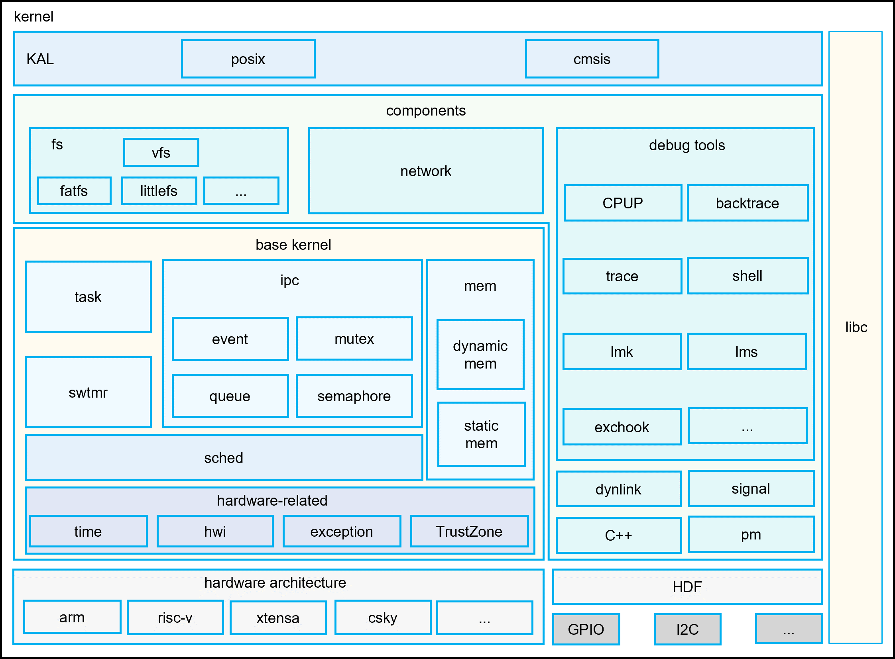

# LiteOS-M Kernel<a name="EN-US_TOPIC_0000001096757661"></a>

-   [Introduction](#section11660541593)
-   [Directory Structure](#section161941989596)
-   [Constraints](#section119744591305)
-   [Usage](#section3732185231214)
-   [Contribution](#section1371123476307)
-   [Repositories Involved](#section1371113476307)

## Introduction<a name="section11660541593"></a>

OpenHarmony LiteOS-M is a lightweight operating system kernel designed for the Internet of Things (IoT) field. It features small footprint, low power consumption, and high performance. It has a simple code structure, including the minimum kernel function set, kernel abstraction layer, optional components, and project directory. The LiteOS-M kernel is divided into the hardware layer and hardware-irrelevant layers. The hardware layer provides a unified hardware abstraction layer (HAL) interface for easier hardware adaptation. A range of compilation toolchains can be used with different chip architectures to meet the expansion of diversified hardware and compilation toolchains in the Artificial Intelligence of Things (AIoT) field.
**Figure1** shows the architecture of the LiteOS-M kernel.

**Figure 1** Architecture of the OpenHarmony LiteOS-M kernel<a name="fig0865152210223"></a>



## Directory Structure<a name="section161941989596"></a>

The directory structure is as follows. For more details, see [arch_spec.md](arch_spec.md).

```
/kernel/liteos_m
├── arch                 # Code of the kernel instruction architecture layer
│   ├── arm              # Code of the ARM32 architecture
│   │   ├── arm9         # Code of the ARM9 architecture
│   │   ├── cortex-m3    # Code of the cortex-m3 architecture
│   │   ├── cortex-m33   # Code of the cortex-m33 architecture
│   │   ├── cortex-m4    # Code of the cortex-m4 architecture
│   │   ├── cortex-m7    # Code of the cortex-m7 architecture
│   │   └── include      # Arm architecture public header file directory
│   ├── csky             # Code of the csky architecture
│   │   └── v2           # Code of the csky v2 architecture
│   ├── include          # APIs exposed externally
│   ├── risc-v           # Code of the risc-v architecture
│   │   ├── nuclei       # Code of the nuclei system technology risc-v architecture
│   │   └── riscv32      # Code of the risc-v architecture
│   └── xtensa           # Code of the xtensa architecture
│       └── lx6          # Code of the lx6 xtensa architecture
├── components           # Optional components
│   ├── backtrace        # Backtrace support
│   ├── cppsupport       # C++ support
│   ├── cpup             # CPU percent (CPUP)
│   ├── dynlink          # Dynamic loading and linking
│   ├── exchook          # Exception hooks
│   ├── fs               # File systems
│   ├── lmk              # Low memory killer functions
│   ├── lms              # Lite memory sanitizer functions
│   ├── net              # Networking functions
│   ├── power            # Power management
│   ├── shell            # Shell function
│   ├── fs               # File systems
│   └── trace            # Trace tool
├── drivers              # driver Kconfig
├── kal                  # Kernel abstraction layer
│   ├── cmsis            # CMSIS API support
│   └── posix            # POSIX API support
├── kernel               # Minimum kernel function set
│   ├── include          # APIs exposed externally
│   └── src              # Source code of the minimum kernel function set
├── targets              # Board-level projects
├── testsuites           # Kernel testsuites
├── tools                # Kernel tools
├── utils                # Common directory
```

## Constraints<a name="section119744591305"></a>

OpenHarmony LiteOS-M supports only C and C++.

Applicable architecture: See the directory structure for the arch layer.

As for dynamic loading module, the shared library to be loaded needs signature verification or source restriction to ensure security.

## Usage<a name="section3732185231214"></a>

The OpenHarmony LiteOS-M kernel build system is a modular build system based on Generate Ninja (GN) and Ninja. It supports module-based configuration, tailoring, and assembling, and helps you build custom products. This document describes how to build a LiteOS-M project based on GN and Ninja. For details about the methods such as GCC+gn, IAR, and Keil MDK, visit the community websites.

### Setting Up the Environment

Before setting up the environment for a development board, you must set up the basic system environment for OpenHarmony first. The basic system environment includes the OpenHarmony build environment and development environment. For details, see [Setting Up Development Environment](https://gitee.com/openharmony/docs/blob/HEAD/en/device-dev/quick-start/quickstart-lite-env-setup.md).

### Obtaining the OpenHarmony Source Code

For details about how to obtain the source code, see [Source Code Acquisition](https://gitee.com/openharmony/docs/blob/HEAD/en/device-dev/get-code/sourcecode-acquire.md). This document assumes that the clone directory is `~/openHarmony` after the complete OpenHarmony repository code is obtained.

### Example projects that are already supported

Qemu simulator: `arm_mps2_an386、esp32、riscv32_virt、SmartL_E802`, For details about how to compile and run, see [qemu guide](https://gitee.com/openharmony/device_qemu)

Bestechnic: `bes2600`, For details about how to compile and run, see [Bestechnic developer guide](https://gitee.com/openharmony/device_soc_bestechnic)

### Community Porting Project Links

The LiteOS-M kernel porting projects for specific development boards are provided by community developers. The following provides the links to these projects. If you have porting projects for more development boards, you can provide your links to share your projects.

-   Cortex-M3:

    - STM32F103 https://gitee.com/rtos_lover/stm32f103_simulator_keil

        This repository provides the Keil project code for building the OpenHarmony LiteOS-M kernel based on the STM32F103 chip architecture. This code supports build in Keil MDK mode.

-   Cortex-M4:

    - STM32F429IGTb https://gitee.com/harylee/stm32f429ig_firechallenger

        This repository provides the project code for porting the OpenHarmony LiteOS-M kernel to support the STM32F429IGTb development board. The code supports build in Ninja, GCC, and IAR modes.

-   Cortex-M7:

    - Nucleo-F767ZI https://gitee.com/harylee/nucleo_f767zi

        This repository provides the project code for porting the OpenHarmony LiteOS-M kernel to support the Nucleo-F767ZI development board. The code supports build in Ninja, GCC, and IAR modes.

## Contribution<a name="section1371123476307"></a>

[How to involve](https://gitee.com/openharmony/docs/blob/HEAD/en/contribute/contribution.md)

[Commit message spec](https://gitee.com/openharmony/kernel_liteos_m/wikis/Commit%20message%E8%A7%84%E8%8C%83)

[Liteos-M kernel coding style guide](https://gitee.com/openharmony/kernel_liteos_m/wikis/OpenHarmony%E8%BD%BB%E5%86%85%E6%A0%B8%E7%BC%96%E7%A0%81%E8%A7%84%E8%8C%83)

How to contribute a chip based on Liteos-M kernel:

[ Board-Level Directory Specifications](https://gitee.com/openharmony/docs/blob/HEAD/en/device-dev/porting/porting-chip-board-overview.md)

[Mini System SoC Porting Guide](https://gitee.com/openharmony/docs/blob/HEAD/en/device-dev/porting/porting-minichip.md)

## Repositories Involved<a name="section1371113476307"></a>

[Kernel Subsystem](https://gitee.com/openharmony/docs/blob/HEAD/en/readme/kernel-subsystem.md)

**kernel\_liteos\_m**
