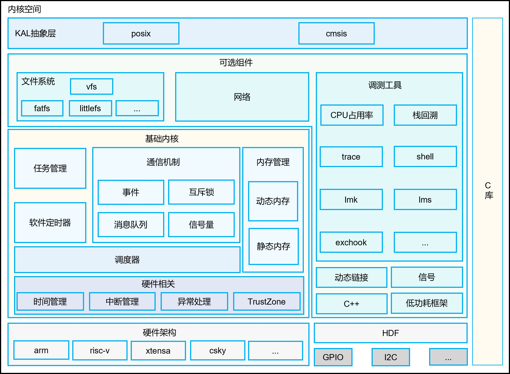

# LiteOS-M内核<a name="ZH-CN_TOPIC_0000001096757661"></a>

-   [简介](#section11660541593)
-   [目录](#section161941989596)
-   [约束](#section119744591305)
-   [使用说明](#section3732185231214)
-   [相关仓](#section1371113476307)

## 简介<a name="section11660541593"></a>

OpenHarmony LiteOS-M内核是面向IoT领域构建的轻量级物联网操作系统内核，具有小体积、低功耗、高性能的特点，其代码结构简单，主要包括内核最小功能集、内核抽象层、可选组件以及工程目录等，分为硬件相关层以及硬件无关层，硬件相关层提供统一的HAL（Hardware Abstraction Layer）接口，提升硬件易适配性，不同编译工具链和芯片架构的组合分类，满足AIoT类型丰富的硬件和编译工具链的拓展。其架构图如图1所示：

**图 1**  OpenHarmony LiteOS-M核内核架构图<a name="fig0865152210223"></a>  


## 目录<a name="section161941989596"></a>

```
/kernel/liteos_m
├── components           # 可选组件
│   ├── cppsupport       # C++支持
│   └── cpup             # CPUP功能
├── kal                  # 内核抽象层
│   ├── cmsis            # cmsis标准接口支持
│   └── posix            # posix标准接口支持
├── kernel               # 内核最小功能集支持
│   ├── arch             # 内核指令架构层代码
│   │   ├── arm          # arm32架构的代码
│   │   └── include      # 对外接口存放目录
│   ├── include          # 对外接口存放目录
│   └── src              # 内核最小功能集源码
├── targets              # 板级工程目录
├── utils                # 通用公共目录
```

## 约束<a name="section119744591305"></a>

开发语言：C/C++；

适用架构：当前只适用于cortex-m3、cortex-m4、cortex-m7、risc-v芯片架构。

## 使用说明<a name="section3732185231214"></a>

LiteOS-M内核提供了三种芯片架构的工程位于targets目录。三种架构的工程编译及使用方式如下：

-   cortex-m3：

kernel/liteos\_m/targets/cortex-m3\_stm32f103\_simulator\_keil目录是基于STM32F103芯片架构构建的keil工程目录，keil开发工具可通过网络下载并安装。进入cortex-m3\_stm32f103\_simulator\_keil/project目录，双击los\_demo.uvproj文件即可打开相应工程，编译成功后即可通过JLINK或者STM32 ST-LINK Utility烧录至对应单板。

-   cortex-m4：

kernel/liteos\_m/targets/cortex-m4\_stm32f429ig\_fire-challenger\_iar目录是基于STM32F429IG芯片架构构建的IAR工程目录，IAR开发工具可通过网络下载并安装。进入cortex-m4\_stm32f429ig\_fire-challenger\_iar/project目录，双击los\_demo.eww文件即可打开相应工程，编译成功后即可通过JLINK或者STM32 ST-LINK Utility烧录至对应单板。

-   cortex-m7：

kernel/liteos\_m/targets/cortex-m7\_nucleo\_f767zi\_gcc目录是基于STM32F767ZI芯片架构构建的Makefile工程目录。编译方式如下：

```
cd kernel/liteos_m/targets/cortex-m7_nucleo_f767zi_gcc
make clean; make
```

编译成功后在cortex-m7\_nucleo\_f767zi\_gcc/build目录下生成NUCLEO-F767.hex可执行文件，通过烧录工具STM32 ST-LINK Utility烧录到对应的单板。

## 相关仓<a name="section1371113476307"></a>

[内核子系统](https://gitee.com/openharmony/docs/blob/master/zh-cn/readme/%E5%86%85%E6%A0%B8%E5%AD%90%E7%B3%BB%E7%BB%9F.md)

**kernel\_liteos\_m**

